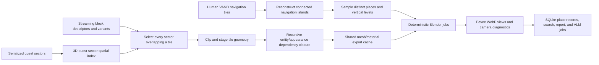

# World Location Database

The world-location pipeline builds records for sampled places, not records for
individual streaming sectors. Its first implementation is deliberately bounded
to six representative 128–256 metre spatial tiles and one additional quest
state. The tile contract lives in
[`tools/world-location-poc-v1.json`](../../tools/world-location-poc-v1.json).

The validated plan contains six spatial tiles, seven assembled tile states, at
most 34 viewpoints, and four 80-degree views per viewpoint (at most 136 WebP
images). Derived data is written beneath
`converted/world-location-database`, which is outside source control.

## Pipeline



The implementation is split by responsibility:

- [`world_location_world.py`](../../tools/world_location_world.py) parses block
  descriptors and mutually exclusive variants, selects overlaps, and clips
  staged sector node data to the tile. Until transformed resource bounds are
  available, it origin-clips only explicitly point-local node types and
  conservatively retains meshes, terrain, roads, entities, and unknown nodes.
- [`world_location_spatial.py`](../../tools/world_location_spatial.py) builds and
  caches a true 3D index over serialized quest/interior sector content. It does
  not treat every quest sector's broad root bounds as proof of overlap.
- [`world_location_nav.py`](../../tools/world_location_nav.py) decodes VAND
  buffers, maps their serialized X/Z/Y component order to world X/Y/Z, joins
  connected polygons across resources, measures islands, and samples them
  deterministically.
- [`world_location_database.py`](../../tools/world_location_database.py)
  orchestrates staging, native resource export, caching, SQLite, search,
  reports, and VLM job generation.
- [`world_location_dependencies.py`](../../tools/world_location_dependencies.py)
  recursively serializes archive-backed entity and appearance resources,
  discovers their depot-path closure, and installs only each state's reachable
  JSON and mesh dependencies.
- [`world_location_render_blender.py`](../../tools/world_location_render_blender.py)
  imports complete staged tile projects and renders validated views with the
  installed Cyberpunk 2077 Blender add-on.

## Six-tile contract

| Tile | Size | Viewpoint cap | Purpose |
| --- | ---: | ---: | --- |
| Kabuki service alley | 192 m | 4 | Narrow pedestrian/service space |
| Jig-Jig Street entrance | 192 m | 4 | Dense commercial street and entrances |
| Kabuki elevated road | 192 m | 6 | Stacked road, street, and underpass levels |
| Megabuilding H10 exterior | 256 m | 4 | Building-scale massing and public approach |
| Afterlife interior | 128 m | 6 per state | Multi-level interior and quest variants |
| Dakota's workshop | 192 m | 4 | Open Badlands terrain and long sight lines |

Afterlife is assembled twice. `open-world` uses the default variant range;
`q005-heist` explicitly selects `q005_Jackie_Claire`, `q005_custom_music`, and
`_default_meshes` alongside default-range content. Keeping these as separate
tile states prevents mutually exclusive quest geometry from appearing in the
same render.

## Inputs

The command defaults describe the current Ghostline workstation and can all be
overridden:

| Argument | Default input |
| --- | --- |
| `--block` | `H:\Ghostline-audits\sq021-world-trace-20260724\block-serialized\all.streamingblock.json` |
| `--sectors-root` | `H:\Ghostline-audits\drop-point-index-20260722\all-sectors` |
| `--quest-json-root` | `H:\Ghostline-audits\vanilla-quest-sectors-20260726` |
| `--game` | `H:\Cyberpunk 2077` |
| `--ghostline-red` | `tools/ghostline-red/target/release/ghostline-red.exe` |
| `--red-schema` | `red-schema.json` |
| `--blender` | `C:\Program Files\Blender Foundation\Blender 5.1\blender.exe` |

The sector root contains binary `.streamingsector` resources. The orchestrator
serializes them through `ghostline-red` and fingerprints the binary, serializer,
schema, and conversion mode. Existing serialized quest sectors are indexed
directly. Entity and appearance resources are recursively serialized from the
installed archives into a content-fingerprinted shared cache. Their mesh leaves
and the meshes referenced directly by sectors are exported once, then the
resulting JSON, GLBs, and material sidecars are hard-linked into each staged
tile when the filesystem permits it. World exports deliberately omit an
appearance filter, so one sidecar contains every appearance required by sector
or entity placements of the same mesh.

## Running the proof of concept

Validate the declarative contract without touching game data:

```powershell
py .\tools\world_location_database.py plan
```

Run a fast metadata smoke test for one tile. This assembles sectors, decodes
navigation, chooses viewpoints, populates SQLite, and writes a render job, but
does not export GLBs:

```powershell
py .\tools\world_location_database.py build `
  --metadata-only `
  --tile dakota-badlands-workshop
```

`--tile` can be repeated. On a fresh output, the other declared states remain
`pending`, so its aggregate POC acceptance report is expected to be incomplete.
On an existing output, selective builds preserve untouched state records and
merge their render jobs, which makes tile-by-tile smoke testing composable. Do
not render a metadata-only build; its jobs intentionally lack the exported mesh
dependencies.

Run the complete six-tile build and render as separate resumable phases:

```powershell
py .\tools\world_location_database.py build --export-threads 8
py .\tools\world_location_database.py render --fail-on-invalid
```

Or run both phases in one command:

```powershell
py .\tools\world_location_database.py poc `
  --export-threads 8 `
  --fail-on-invalid
```

The complete command intentionally performs a large recursive entity/appearance
serialization, native mesh/material export, and up to 136 headless Blender
renders. Run it only with adequate free scratch space. Serialization, quest
indexing, dependency closure, and mesh export are content-fingerprinted and
reusable after an interrupted run.

## Derived layout

```text
converted/world-location-database/
  locations.sqlite3
  six-tile-render-jobs.json
  six-tile-render-report.json
  poc-report.json
  poc-report.md
  vlm-jobs.jsonl
  cache/
    serialized-sectors/
    quest-sector-spatial-index.json
    dependencies/
      archive-json/
      dependency-report.json
    export-project/source/raw/
    meshes/
  tiles/<tile>--<state>/
    assembly-manifest.json
    project/source/raw/
  renders/<tile>--<state>/
```

Each assembly manifest records contributing sectors, selected variant IDs,
source fingerprints, clipped node/instance counts, navigation sources,
candidate counts, resource scan results, failures, and timings. Blender writes
per-tile diagnostics plus the aggregate render report. Output replacement is
atomic so an interrupted render does not masquerade as a complete image.

## Database and queries

`locations.sqlite3` stores runs, six tile definitions, seven tile states,
contributing sectors, navigation islands, sampled places, rendered images,
resource/export status, and measured timings. Place rows carry coordinates,
orientation, interior state, island identity, nearby resources, structural
facts, renderer fingerprints, and a separate JSON slot for VLM tags.

Search uses labels, district/area, archetype, expected signals, structural
facts, nearby resources, and VLM tags:

```powershell
py .\tools\world_location_database.py search "long sight line"
py .\tools\world_location_database.py search entrance --district Watson
py .\tools\world_location_database.py search "" --archetype multilevel_interior
```

Export one JSONL tagging job per rendered place:

```powershell
py .\tools\world_location_database.py vlm-export
```

Each job supplies all views and asks for separate atmosphere, architecture,
faction-signal, condition, lighting, combat, stealth, quest-theme, landmark,
and confidence fields. `--include-unrendered` is useful only for inspecting the
job schema before Blender has run.

Import model results atomically after adding `place_id` and either a `tags` or
`response` object to each JSONL row:

```powershell
py .\tools\world_location_database.py vlm-import .\vlm-results.jsonl
```

Recognized fields are the nine tag groups above plus numeric `confidence`.
Unknown place IDs, malformed JSON, and incorrectly typed tag values abort the
transaction instead of leaving a partially tagged database.

Regenerate acceptance reports at any point:

```powershell
py .\tools\world_location_database.py report
```

## Acceptance gates

`poc-report.json` and `poc-report.md` expose machine- and human-readable checks:

- exactly six spatial tiles and at least one additional variant state;
- every selected tile state assembled with contributing sectors and places;
- every viewpoint came from navigation rather than the anchor fallback;
- four complete direction images per retained place;
- renderer sector/mesh/entity/appearance/node/instance coverage has no
  error-level shortfall;
- no failed entity/appearance serialization or requested mesh export.

Renderer reports add floor presence, floor normal, camera clearance, headroom,
near-surface probes, forward clearance, eight-direction openness, stale-output
detection, image dimensions/hash/luminance, missing texture/material warnings,
instance reuse ratio, importer timing, and renderer/content fingerprints.

The proof of concept still simplifies animated advertisements, traffic, crowds,
particles, fog, and REDengine lighting. Entity and appearance JSON are staged,
but animated rigs, animations, dynamic device state, and runtime appearance
overrides are not reproduced. Runtime door state can differ from the staged
sector, and ray validation cannot prove gameplay collision or quest lifecycle
safety.
