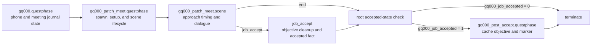

# Questphase, Scene, And Localization Flow

This document is the concrete reference for the working `gq000` meeting flow.
It records the current resource ownership, runtime order, scene handoff, and
localization lookup rules established from the July 2026 tests and the audited
vanilla `mq003`, `mq007`, and `mq010` scenes.

Use this document for the overall runtime model. Use
`docs/scene-authoring-rules.md` for vanilla-shaped scene structures,
`docs/world-references.md` for world and NodeRef details, and
`docs/crash-investigation.md` for the evidence behind failed probes.

`patch` is the logical scene actor and community-entry name. The current world
registry maps that entry to `Character.GhostlinePatch`. The preceding Judy
isolation run validated the Ghostline lifecycle; the custom record, entity,
appearance, faction, and dependencies are the variables in the current
installed test candidate.

The community phase must request exposed root appearance
`ghostline_patch_default`. The root mapping then selects internal `.app`
definition `default`. The first custom run used `default` at the community
layer, producing an invisible puppet that the scene could still acquire and
label as Patch.

## Runtime Ownership

Each resource layer has a different job. Keeping these boundaries explicit is
the main lesson from the stable meeting build.

| Layer | Owns |
| --- | --- |
| World resources | Community registry and area, AI spot, physical trigger volumes, scene marker, and map-pin markers. |
| Root questphase | Phone and journal staging, phone state facts, child-phase sequencing, and the accepted-state branch. |
| Meeting questphase | Community activation, spawn readiness, the broad setup gate, checkpoint, scene launch, and scene-exit side effects. |
| Scene | Actor acquisition, cinematic AI tier, inner approach timing, dialogue, choices, and a named exit signal. |
| Post-accept questphase | Cache objective, description, mappin, and started-fact skeleton. |

The scene acquires the logical Patch-role actor from an already
active and validated community. It does not own community spawning. Conversely,
proximity-dependent presentation belongs in the running scene rather than in a
chain of questphase gates before scene launch.

## Current End-To-End Flow



### Root Questphase

ArchiveXL registers
`mod\gq000\phases\gq000.questphase` as a root questphase under
`base\quest\cyberpunk2077.quest`.

The current graph is:

```text
input
  -> if gq000_phone_start_sent == 0:
       activate Patch's phone message
       activate the meeting reply choice group
       set gq000_phone_start_sent = 1
     else:
       resume at the reply wait
  -> wait until the "On my way" phone reply is visited
  -> set gq000_phone_reply_on_my_way = 1
  -> activate and track Meet Patch objective
  -> activate meeting description
  -> activate bridge quest mappin
  -> run gq000_patch_meet.questphase
  -> if gq000_job_accepted == 1:
       run gq000_post_accept.questphase
     else:
       terminate
```

`On my way` accepts the meeting, not the job. The job is accepted only when
the dialogue scene exits through `job_accept`.

### Meeting Questphase

The current `gq000_patch_meet.questphase` graph is:

```text
input
  -> SpawnManager Activate patch/default
     at #gq000_01_com_patch_bridge
  -> wait CharacterSpawned > 0 for that whole community
  -> wait player IsInside #gq000_01_tr_setup
  -> checkpoint "gq000_patch_meet"
  -> start gq000_patch_meet.scene through entry point "start"
     at #gq000_01_sm_patch_bridge
```

The `SpawnManager` action and `CharacterSpawned` condition must reference the
same community NodeRef. The community currently has `active_on_start: 0`, so
phase activation is required. There is no explicit `Deactivate` action yet;
final quest design must decide when Patch should be released or retained.

The questphase scene node exposes two meaningful exits:

```text
scene.end
  -> terminate meeting phase
  -> leave gq000_job_accepted unchanged (default 0 on a clean run)
  -> root checks the current value
  -> root terminates

scene.job_accept
  -> mark Meet Patch objective Succeeded
  -> make the bridge quest mappin Inactive
  -> set gq000_job_accepted = 1
  -> terminate meeting phase
  -> root starts the post-accept phase
```

The active dialogue currently reaches only `job_accept`. Scene end node `18`
has no incoming scene-graph edge, although `exitPoints` maps it to `end` and the
questphase `end` socket is wired. If a refusal or walk-away branch is added, it
needs an explicit objective/mappin cleanup policy; the current `end` route
would leave the meeting UI active.

### Running Scene

The `start` node launches two parallel paths:

```text
start
  +-> set the patch/default actor's Puppet AI tier to Cinematic
  |
  +-> wait inside #gq000_01_tr_bridge_case_mood and not in combat
        -> wait inside #gq000_01_tr_someone_coming
        -> Patch opening line
        -> wait inside #gq000_01_tr_engage
        -> first choice group
```

The Puppet AI path is a fire-and-forget side effect; it has no rendezvous back
into the dialogue chain.

The dialogue graph is:

```text
Ghostline? ------ response ------+
Why me? --------- response ------+-> first choice group
What's the job? -> explanation -----> second choice group

Who's behind it? -> response -------> second choice group
I'm in. ---------> acceptance lines -> job_accept
```

The scene's entry and exit point names must exactly match the sockets on the
questphase scene node. A scene end node is not enough by itself; an
`exitPoints` entry maps the node ID to the emitted name.

### Post-Accept Questphase

The current `gq000_post_accept.questphase` is deliberately small:

```text
activate and track Reach Cache objective
  -> activate cache description
  -> activate cache mappin
  -> set gq000_02_started = 1
  -> terminate
```

This is a UI/progression skeleton. It does not detect reaching, acquiring, or
delivering the cache and does not complete the quest.

## Persistent State And Journal Paths

Quest facts are signed integer state and read as `0` before they are explicitly
set. The current staging facts are:

| Fact | Set by | Meaning |
| --- | --- | --- |
| `gq000_phone_start_sent` | Root questphase | The initial Patch message and reply group have been activated. |
| `gq000_phone_reply_on_my_way` | Root questphase | The meeting reply was visited; this is not job acceptance. |
| `gq000_job_accepted` | Meeting questphase after `job_accept` | The dialogue acceptance route completed and the root may start post-accept. |
| `gq000_02_started` | Post-accept questphase | The cache objective, description, and mappin were activated. |

Journal nodes must use the full `gameJournalPath.realPath`. Their
`fileEntryIndex` is the zero-based path-component index of the containing
`gameJournalFileEntry`, not the leaf index and not a CR2W handle:

- phone paths under `contacts/patch/...` use `fileEntryIndex: 1` for `patch`;
- quest paths under `quests/minor_quest/gq000/...` use `fileEntryIndex: 2` for
  `gq000`;
- POI paths under `points_of_interest/minor_quests/...` use
  `fileEntryIndex: 1` for `minor_quests`.

Journal entry IDs and paths are not localization IDs. Journal fields refer to
onscreen localization by secondary key as described below.

## Approach Trigger And NodeRef Contract

The current tested bridge baseline uses concentric horizontal footprints and a
12-unit vertical height:

| NodeRef | Radius | Owner | Purpose |
| --- | ---: | --- | --- |
| `#gq000_01_tr_setup` | 90 | Meeting questphase | Start the already spawn-ready scene. |
| `#gq000_01_tr_bridge_case_mood` | 60 | Scene | Begin the inner approach sequence when the player is not in combat. |
| `#gq000_01_tr_someone_coming` | 20 | Scene | Allow Patch's opening line. |
| `#gq000_01_tr_engage` | 10 | Scene | Present the first dialogue choices. |

Other active references are:

| NodeRef | Purpose |
| --- | --- |
| `#gq000_01_com_patch_bridge` | Streamable community acquired by the phase and scene actor. |
| `#gq000_01_spot_patch_bridge` | Community AI spot. |
| `#gq000_01_sm_patch_bridge` | Scene placement marker. |
| `#gq000_01_mp_patch_bridge` | Meeting journal/POI map-pin marker. |
| `#gq000_02_mp_cache` | Post-accept cache map-pin marker. |

The trigger volumes, AI spot, and community area live in the streamed Quest
sector. The concrete scene/map marker nodes and community registry live in the
AlwaysLoaded sector. Their shorthand `#gq000...` references depend on both the
streaming-block binding
`$/mod/gq000/#gq000_pr_patch_meet` and the questphases' matching
`phasePrefabs` declarations.

Keep the scene marker and map-pin marker separate. The current scene marker is
still a direct child of the quest prefab root; a future world rebuild should
nest it under a scene-prefab child path like `mq003` while leaving map-pin
markers at the quest-prefab root.

The observed nearby fast-travel arrival, roughly 101.5 horizontal units from
the origin, lies outside the 90-unit setup trigger but inside community
streaming range. The older 150-unit build placed that arrival inside setup and
failed during `Loading world` at `Cyberpunk2077+0x19088d0`. Several world and
lifecycle fixes changed together, so that crash's individual cause was not
isolated; the overlap remains an ordering risk rather than a proven sole cause.
HUD distance is useful for observation but is not an exact trigger measurement
because navigation, rounding, and vertical distance can differ from the
trigger's horizontal footprint.

## Why The Order Matters

The stable flow follows the audited `mq003` lifecycle:

1. Activate the whole community.
2. Wait until the required actor community is spawned.
3. Start the scene from a broad setup/cinematic boundary.
4. Let the running scene register and wait on narrower approach gates.
5. Return a named outcome to the questphase for persistent state changes.

Do not start the scene at the 10-unit engage gate. In that shape, the 60- and
20-unit conditions are already true, so actor setup, Puppet AI, the opening
line, and engagement can cascade during the same scene-start tick.

Moving launch from 10 units to 90 units moved the same crash to the new launch
boundary. That proved the physical trigger was not the direct fault: scene
initialization was exercising a malformed lookup. The final scene-start crash
was a lipsync resource cardinality error. The Patch-role actor requested slot
`0`, V requested slot `1`, but the two raw rows used the same depot path and
cooked to one addressable import. The runtime then requested index `1` from a
one-entry table.

The current scene assigns both performers to slot `0` and emits one generic
lipsync resource. The otherwise-identical pre-sort shared-slot baseline
completed the full meeting route; the current sorted-locStore candidate
preserves that diagnostic configuration but still needs its focused runtime
regression. This is not the desired final facial-animation setup. A final
two-slot design must provide two distinct, valid NPC/V resources and confirm
that both remain addressable after cooking.

Other required invariants:

- Keep the 12-unit trigger height; shallower bridge volumes can miss the player
  because of elevation variation.
- Preserve full unsigned 64-bit scene event and locStore variant IDs. Do not
  apply the old signed-63-bit mask.
- Keep the community registry node's global ID distinct from the
  community/source ID.
- Keep the scene marker and journal map-pin marker distinct and resolvable.
- WolvenKit CR2W handle references must be backward-resolvable; forward
  `HandleRefId` use can fail deserialization.
- Use a pre-Ghostline save for lifecycle tests. Facts, visited journal entries,
  checkpoints, and active scene state persist in saves.

## The Three Localization Paths

Ghostline uses three separate runtime lookup paths. A fix in one path does not
repair another.

| Content | Authoritative reference | Runtime data |
| --- | --- | --- |
| Journal, objective, mappin, and phone UI | String secondary key such as `gl_gq000_01_objective_meet_patch` | ArchiveXL-registered onscreen localization JSON. |
| Spoken scene line | Numeric `scnlocLocstringId` | Subtitle entry plus VO-map entry and matching WEM. |
| Player choice label | Numeric `scnlocLocstringId` | The scene's embedded `locStore`. |

### Journal And Onscreen UI

Journal fields contain the textual localization key in their localization
value, for example `gl_gq000_02_objective_reach_cache`. The matching
`localizationPersistenceOnScreenEntry` lives in:

`source/raw/mod/gq000/localization/en-us/onscreens/gq000.json.json`

For Ghostline-added entries:

- use `primaryKey: 0`;
- use a globally unique textual `secondaryKey`;
- put the same secondary key in the journal localization field;
- register the packed onscreen resource in
  `source/resources/Ghostline.archive.xl`.

These keys are not scene locstring RUIDs and should not be converted into one.

### Spoken Dialogue

For spoken lines, the stable link is the numeric string ID:

```text
source/raw/gq000_01_manifest.json spoken_lines[].string_id
  -> scene screenplayStore.lines[].locstringId
  -> same numeric ID joins both registered runtime paths:

     source/resources/Ghostline.archive.xl localization.subtitles
       -> mod/gq000/localization/en-us/subtitles/gq000_01_subtitles_map.json
       -> subtitleFile mod/gq000/localization/en-us/subtitles/gq000_01.json
       -> subtitle entry stringId and text

     source/resources/Ghostline.archive.xl localization.vomaps
       -> mod/gq000/localization/en-us/vo/gq000_01.json
       -> VO-map entry stringId
       -> female/male WEM resource path
```

The screenplay item ID is a separate graph-local ID. Spoken screenplay items
use `1 + 256n`; that value is not the localization string ID.

The current external subtitle and VO resources contain the 13 spoken IDs only:

- `source/raw/mod/gq000/localization/en-us/subtitles/gq000_01.json.json`
- `source/raw/mod/gq000/localization/en-us/vo/gq000_01.json.json`

Adding a choice ID to those resources does not fix a choice label. Choice text
uses the embedded scene lookup described below.

### Choice Labels And Embedded LocStore

The runtime choice-label chain is:

```text
scnChoiceNodeOption.screenplayOptionId
  -> screenplayStore.options[].itemId
  -> screenplayStore.options[].locstringId
  -> locStore.vdEntries matching locale + locstringId + signature
  -> descriptor.vpeIndex
  -> locStore.vpEntries[vpeIndex].content
```

`scnChoiceNodeOption.caption` is an authoring/debug `CName`. It is useful when
exploring a graph, but it is not the authoritative player-visible text and is
not a reliable fallback. In the broken build the caption for
`Who's behind it?` was correct while the game displayed stale `Why me?` text.

The embedded arrays have distinct roles:

- `vdEntries` are lookup descriptors. Each contains `localeId`, the base
  `locstringId`, signature, a `variantId`, and a zero-based `vpeIndex`.
- `vpEntries` are text payloads. Each contains `content` and the same
  `variantId` as its descriptor.

Do not reorder descriptors without preserving their payload indices. If a
descriptor/payload pair is moved together, recalculate `vpeIndex` so it still
points at the matching payload.

The current Ghostline scene has five choices and 20 descriptor/payload pairs:

- two `db_db` variants per choice: blank fallback first, source text second;
- one `pl_pl` variant per choice;
- one `en_us` variant per choice.

`pl_pl` currently repeats the authored English source text to preserve the
vanilla descriptor shape. It is not a finished Polish translation.

#### Required LocStore Ordering

`vdEntries` are contiguous locale blocks in the configured order:

```text
db_db -> pl_pl -> en_us
```

Inside every block, descriptors must be sorted by the unsigned numeric value
of `locstringId`. Do not use manifest order and do not sort decimal strings
lexicographically. Duplicate `db_db` descriptors remain adjacent, with the
blank payload before the source payload.

The current sorted choice order is:

```text
914191732112522175   Ghostline?
1612649723253519215  Who's behind it?
4736889953703698319  Why me?
6832076283350341234  I'm in.
9013107628483726133  What's the job?
```

The stale build grouped entries by locale but retained manifest/dialogue order.
At runtime two first-menu rows were blank and `Who's behind it?` resolved as
`Why me?`. All four audited vanilla scenes sort each locale block numerically.
WolvenKit preserves the order it is given; serialize/deserialize round trips do
not repair a malformed locStore.

Blank-before-source ordering for equal-ID `db_db` pairs is the current
Ghostline generator contract, not a universal vanilla rule; audited vanilla
scenes also contain source-before-blank pairs. The generator plus checked-in
raw equality regression preserve the exact descriptor/payload mapping. The
validator separately checks locale blocks, numeric ordering, at least two
`db_db` payloads, and a blank payload first. Runtime confirmation of the
intended five-label repair is still pending for the sorted-locStore build.

## ID Domains

Several unrelated numeric domains occur in the same scene. Do not derive one
from another or reuse values merely because their serialized shapes look
similar.

| Domain | Serialized type | Purpose |
| --- | --- | --- |
| Screenplay item | `scnscreenplayItemId` | Graph-local line/option identity. Lines use `1 + 256n`; options use `2 + 256n`. |
| Localization string | `scnlocLocstringId.ruid` | Stable identity of spoken text or choice text from the manifest. |
| Localization variant | `scnlocVariantId.ruid` | Identity of one locale payload in the embedded locStore. |
| Scene event | `scnSceneEventId.id` | Identity of a timed scene event. |
| Actor | `actorID` / `performerID` | Screenplay ownership versus section performer references. |
| Scene graph node | `scnNodeId` | Scene graph identity. |
| CR2W handle | `HandleId` | Serialized object identity and handle references. |

Generated event and variant IDs use deterministic FNV-1a 64-bit output, and
validation requires event IDs to remain unique. LocStore variant allocation
also reserves spoken/choice locstring IDs and previously allocated variants to
avoid collisions. Keep the full unsigned value as a decimal string. The old
`INT63_MASK` probe produced an approach crash and must not return.

## Authoring And Verification Workflow

The current sources of truth are:

- dialogue manifest: `source/raw/gq000_01_manifest.json`;
- scene spec: `tools/gq000_patch_meet.scene-spec.json`;
- generator and validator: `tools/generate_scene.py`;
- generated raw scene:
  `source/raw/mod/gq000/scenes/gq000_patch_meet.scene.json`;
- packed scene: `source/archive/mod/gq000/scenes/gq000_patch_meet.scene`.

Do not edit the packed scene as text. Change the manifest/spec or generator,
regenerate raw CR2W-JSON, validate the checked-in raw artifact, then use
WolvenKit to deserialize it.

Useful inspection commands:

```powershell
py -B .\tools\explore_questphase.py -f .\source\raw\mod\gq000\phases\gq000.questphase.json dot
py -B .\tools\explore_questphase.py dot
py -B .\tools\explore_scene.py dot
py -B .\tools\explore_scene.py choices
py -B .\tools\explore_localization.py check
```

Generation and validation:

```powershell
py -B .\tools\generate_scene.py audit --spec .\tools\gq000_patch_meet.scene-spec.json
py -B .\tools\generate_scene.py generate --spec .\tools\gq000_patch_meet.scene-spec.json --dry-run
py -B .\tools\generate_scene.py generate --spec .\tools\gq000_patch_meet.scene-spec.json
py -B .\tools\generate_scene.py validate --file .\source\raw\mod\gq000\scenes\gq000_patch_meet.scene.json --spec .\tools\gq000_patch_meet.scene-spec.json
py -B -m unittest discover -s tests -v
```

When the raw output is intentional and validated:

```powershell
py -B .\tools\generate_scene.py generate --spec .\tools\gq000_patch_meet.scene-spec.json --deserialize
```

Then serialize the packed CR2W back to JSON and compare the scene graph,
locStore descriptors/payloads, and resource references. Packing success alone
does not prove runtime lookup tables are structurally valid.

## Vanilla Evidence

The primary scene references are:

- `reference/vanilla_extract_json/mq003/mq003_01_homeless.scene.json`
- `reference/vanilla_extract_json/mq003/mq003_03_orbital_pod.scene.json`
- `reference/vanilla_extract_json/mq007/mq007_01_gun_found.scene.json`
- `reference/vanilla_extract_json/mq010/mq010_02_barry_talk.scene.json`

The local public modding documentation is incomplete for full quest/scene
creation. Treat the vanilla extracts and tested Ghostline invariants as the
structural reference, while keeping failed probes in
`docs/crash-investigation.md` as historical evidence rather than authoring
templates.
