# Vanilla Cyberpsycho Encounter Reference

This note records the reusable parts of a Cyberpunk 2077 Cyberpsycho Sighting.
It is based on the installed game resources for:

- `ma_wat_kab_08` — Lt. Mower, a compact single-boss encounter with a custom
  entity and health-driven effects;
- `ma_pac_cvi_15` — Lex Talionis, a boss encounter with supporting goons,
  droids, devices, and an evidence gate;
- `ma_wat_nid_15` — Bloody Ritual, an investigation-first encounter with a
  delayed reveal;
- the global
  `base\open_world\phases\cyberpsychos\open_world_cyberpsychos.questphase`;
- the installed TweakDB and gameplay scripts.

The conclusion is that a Cyberpsycho encounter is a composition, not a special
quest node. The boss HUD, Cyberpsycho combat behavior, journal category,
world/community lifecycle, fight resolution, fixer exchange, reward, and
cleanup are separate contracts.

## Boss health HUD

The remembered overlay is the ordinary boss health bar. For a Cyberpsycho, its
essential authored gate is:

```yaml
rarity: NPCRarity.Boss
```

The installed gameplay scripts establish this runtime sequence:

1. `ScriptedPuppet.IsBoss()` returns true when the character's NPC rarity is
   `Boss`.
2. When that NPC gains the player as a hostile threat,
   `TargetTrackingExtension.AddPotentialBossTarget` marks it as eligible.
3. Once the NPC has been properly seen by the player, target tracking asks
   `BossHealthBarGameController` to reevaluate the boss.
4. The health-bar controller accepts `Boss` or `MaxTac` rarity and displays the
   current health pool. Dealing damage to a boss is a second route that adds
   the bar.
5. The label uses `Character_Record.FullDisplayName` when valid and falls back
   to the puppet's display name.
6. The bar is removed when the threat is defeated, combat ends, the boss is
   inactive/friendly, or the boss detaches. A
   `Chimera.HideBossHealthBar` status effect can explicitly suppress it.

Two fields visible in serialized entity/type data are runtime state, not the
primary authoring interface:

- `TargetTrackingExtension.m_canBeAddedToBossHealthbar` is set after a
  boss-rarity NPC acquires the player as a hostile threat.
- `ScriptedPuppet.m_isCyberpsycho` is cached from the character record's
  `Cyberpsycho` tag.

Do not try to make the feature by patching those entity booleans. Author a
proper TweakDB character record and let the runtime derive them.

`bossHealthBarThresholds` is optional segmentation data. It is empty on both
Lt. Mower and Lex Talionis, so it is not required for the overlay.

## Boss character record

Both sampled characters share this core:

| Field | Lt. Mower | Lex Talionis | Contract |
|---|---|---|---|
| `rarity` | `NPCRarity.Boss` | `NPCRarity.Boss` | Required for the boss HUD and boss behavior |
| `tags` | `Cyberpsycho` | `Cyberpsycho` | Required for Cyberpsycho-specific runtime classification |
| base stats | `Character.NPC_Base_Primary_Stat_ModGroup` | same | Normal NPC stat foundation |
| psycho stats | `Character.Cyberpsycho_ModGroup` | same | Cyberpsycho health, poise, control, and finisher tuning |
| hit reactions | `Character.Cyberpsycho_HitReaction_Resistance` | same | Longer resistance windows |
| target tracking | `TargetTracking.DefaultPreset` | same | Supplies hostile-threat tracking used by the HUD |
| nameplate | `UINameplate.CombatSettings` | same | Normal combat nameplate behavior |
| scanner | `ScanningNPCPresets.ScannerPreset_NPCFull` | same | Full NPC scanner data |
| defeated state | enabled | enabled | `disableDefeatedState: false` permits incapacitation |

A Ghostline TweakXL record should make the audited fields explicit, even when
its chosen base currently inherits some of them:

```yaml
Character.gqXXX_cyberpsycho:
  $base: Character.Quest_NPC_Base
  entityTemplatePath: mod\gqXXX\characters\cyberpsycho.ent
  displayName: gqXXX_cyberpsycho_name
  fullDisplayName: gqXXX_cyberpsycho_name
  rarity: NPCRarity.Boss
  tags: [Cyberpsycho]
  statModifierGroups: [Character.NPC_Base_Primary_Stat_ModGroup, Character.Cyberpsycho_ModGroup, Character.Cyberpsycho_HitReaction_Resistance]
  threatTrackingPreset: TargetTracking.DefaultPreset
  uiNameplate: UINameplate.CombatSettings
  scannerModulePreset: ScanningNPCPresets.ScannerPreset_NPCFull
  disableDefeatedState: false
```

`Character.Cyberpsycho_ModGroup` currently contains twelve modifiers. The most
important behavioral signals are:

- health multiplier `1.5`;
- hit-reaction factor multiplier `0.5`;
- increased impact, stagger, and knockdown thresholds;
- tranquilizer immunity;
- health-derived poise;
- a finisher health clamp.

`Character.Cyberpsycho_HitReaction_Resistance` adds recovery time after
knockdown, stagger, impact, and melee hit reactions.

These groups make the NPC fight like a Cyberpsycho. `NPCRarity.Boss` makes it a
boss and is what admits it to the boss-health-bar flow. The `Cyberpsycho` tag
also makes `IsCharacterCyberpsycho()` true and blocks ordinary finisher
threshold behavior. None of those replace the need for a valid archetype,
equipment, abilities, attitude/reaction presets, display names, entity
template, and appearance.

## Journal and map identity

The individual quest's journal entry has:

```text
type = CyberPsycho
```

This controls the Cyberpsycho quest-list category and icon. It does not control
the boss health bar.

Lt. Mower's journal demonstrates the expected content shape:

- root quest plus description;
- `find_psycho`;
- `kill_psycho`/neutralize objective;
- intro-message objective;
- evidence/shard objective;
- fixer-report objective;
- quest mappins on arena or boss NodeRefs;
- optional codex links for cyberpsychosis, the fixer, and relevant factions.

Ghostline can use the same quest type without joining Regina's global
`mq043_cyberpsychos` chain.

## Individual encounter lifecycle

A practical common denominator across the three sightings is:

```mermaid
flowchart LR
    A["Activate CyberPsycho journal entry and area mappin"]
    B["Enter outer trigger"]
    C["Activate community and wait for spawn"]
    D["Reveal: scan, sight, attack, hit, clue, or scripted beat"]
    E["Start hostility and enable mortal combat state"]
    F["Boss fight; optional health-threshold beats"]
    G["Resolved: defeated, unconscious, or killed"]
    H{"Lethal?"}
    I["Spared report path"]
    J["Killed report path"]
    K["Evidence/message gate"]
    L["Reward, success, counters"]
    M["Distance/exit cleanup and community deactivation"]

    A --> B --> C --> D --> E --> F --> G --> H
    H --> I --> K
    H --> J --> K
    K --> L --> M
```



The reveal is deliberately encounter-specific:

- Lt. Mower listens for scan, boss attack, player hit, or boss vision and
  moves into an arena/mortality gate.
- Bloody Ritual completes investigation beats before revealing its psycho.
- Lex Talionis brings up a multi-entry community and combines the boss with
  droids, goons, and device interactions.

The sampled phases also use health conditions for bespoke barks, FX, status
effects, and behavior changes. Lt. Mower has seven health-condition nodes and
Lex has three. These are optional encounter flavor, not part of the minimum
boss contract.

## Resolution and nonlethal handling

The misleadingly named `questCharacterKilled_ConditionType` can observe three
outcomes independently:

- `killed`;
- `defeated`;
- `unconscious`.

Vanilla uses that distinction to support Regina's keep-them-alive contract:

- a broad fight-resolution condition accepts all three states;
- a lethal-only branch enables `killed` and disables `defeated` and
  `unconscious`;
- a spared branch disables `killed` and accepts defeated/incapacitated states.

The encounter should first wait for broad resolution, then preserve a separate
lethal/spared result for dialogue, rewards, and analytics. Do not use a
kill-only condition as the sole completion gate.

The global vanilla phase is not the fight controller. It handles the
`Psycho Killer` umbrella quest, tutorials, journal progress, and counters such
as `ow_psychos_done` and `ow_psychos_killed`. Each sighting owns its spawn,
fight, report, reward, and cleanup.

## World and community resources

The minimum world contract is:

- a `communityCommunityTemplate` with a named boss entry and phase;
- a world community node that references the template;
- an AI workspot/spawn NodeRef used by that community phase;
- an outer activation/reveal trigger;
- an arena or mortality trigger when the boss should not be mortal from the
  first streamed frame;
- quest mappin NodeRefs;
- an exit/distance cleanup gate;
- working navigation and combat space.

Optional resources include clue objects, readable shards, corpses, devices,
doors, droids/goons, post-combat city scenes, audio emitters, and FX nodes.

Lt. Mower's community is one `psycho/default` entry using
`Character.ma_wat_kab_08_cyberpsycho`. Lex has `psycho/start` plus two goons
and two droids. Both phase graphs explicitly activate their community entries
and later clean them up.

## Registration

The standalone vanilla test definitions demonstrate the normal resource
chain:

```text
.gamedef
  -> .quest
    -> encounter .questphase
      -> community, journal, scenes, world NodeRefs, and TweakDB character
```

Each `.gamedef` points at Night City, the compiled streaming world, its quest
resource, and an encounter spawn-point tag. Ghostline's ArchiveXL registration
can supply the equivalent integration; it does not need to copy the vanilla
global Psycho Killer phase.

## Ghostline compiler implementation

The existing schema-v1 `combat_encounter` is a useful inner combat block, but
it remains a generic whole-community fight. Its generated phase currently:

- optionally waits for one trigger;
- activates a whole community;
- waits for the community to spawn;
- optionally sends per-entry threat/hostility actions;
- waits for the whole community to be killed, defeated, or unconscious;
- optionally completes one objective/fact and deactivates the community.

Several declared controls are not yet reflected by the built-in generator:

- `activate`;
- `completion` variants other than the hard-coded whole-community condition;
- `nonlethal_allowed`;
- separate named-boss resolution;
- separate lethal/spared output;
- reveal conditions beyond one world trigger;
- mortality gating;
- boss health-threshold events;
- evidence, phone report, reward, and delayed cleanup.

Ghostline now provides a separate generated `cyberpsycho_encounter` block for
the named-boss lifecycle. It activates one community, waits for one named
entry, protects it during reveal, races the configured vanilla reveal
conditions, applies mortal state, assigns `#player` as the boss's explicit
combat target, injects the hostile player threat, and preserves distinct
lethal and nonlethal outcomes. Existing `reach_area`, `investigate_clues`,
`read_shard`, phone, reward, and cleanup blocks still own the surrounding
quest beats.

## Typed contract

The minimum contract is:

```yaml
type: cyberpsycho_encounter
community: "#gqXXX_cyberpsycho_com"
boss_entry: psycho
boss_character: Character.gqXXX_cyberpsycho
activation_trigger: "#gqXXX_tr_outer"
reveal:
  trigger: "#gqXXX_tr_reveal"
  scan: true
  attacked_by_boss: true
  boss_hit_by_player: true
  boss_sees_player: true
arena_trigger: "#gqXXX_tr_arena"
resolution:
  allow_nonlethal: true
  spared_fact: gqXXX_psycho_spared
  killed_fact: gqXXX_psycho_killed
cleanup:
  trigger: "#gqXXX_tr_cleanup"
  deactivate_community: true
authoring:
  world_spec: tools/gqXXX.world.json
  tweak_file: source/resources/r6/tweaks/ghostline/gqXXX_cyberpsycho.yaml
```

Journal, mappin, evidence, phone, reward, and optional threshold beats should
remain composable references rather than becoming one monolithic generated
phase. `authoring` is optional during prototyping; once present, its paths are
workspace-relative and turn on cross-resource validation.

The compiler validates:

- the TweakXL file explicitly defines `boss_character`;
- its authored rarity is `NPCRarity.Boss`;
- it has the `Cyberpsycho` tag and both Cyberpsycho modifier groups;
- it explicitly supplies entity, display/full display name, target-tracking,
  combat-nameplate, and scanner fields;
- the community contains `boss_entry` and uses that character record;
- a compiler-activated community starts inactive;
- the activation, reveal, arena, and cleanup NodeRefs occur in the world spec;
- lethal and spared outcomes cannot collapse to the same fact;
- at least one reveal route exists and every nested field has the expected
  type.

The compiler cannot prove a runtime TweakDB inheritance chain, registered
streaming world, sight acquisition, or HUD presentation. That remains part of
the first encounter's runtime acceptance pass. The runnable authoring example
is `quests/examples/cyberpsycho_encounter.quest.json`; it uses
`Character.GhostlineGothBaddie` as its concrete boss record.

## Ghostline Goth Baddie implementation

`quests/tests/gqt006_goth_baddie_cyberpsycho.quest.json` is the complete
placed implementation. Its five generated stages:

1. activate, reveal, fight, and resolve Goth Baddie while retaining distinct killed
   and spared facts;
2. grant a quest-owned readable datashard after either outcome;
3. present and wait for the shard to be read;
4. wait until V leaves the cleanup volume, then deactivate the community;
5. branch Patch's opening report on Goth Baddie's outcome, converge on player
   responses, pay the reward, and complete the quest.

All physical placement lives in
`quests/tests/gqt006/implementation/world/goth-baddie-cyberpsycho.world.json`. The marker, four concentric
volumes, community, and Goth Baddie's workspot derive from one `origin`. The selected
site is `(-1026.8678, 1279.5898, 5.1301804)` with yaw
`2.931411456` degrees. Four supplied nearby positions define the alerted patrol
loop and its two workspots. The package is registered in
`source/resources/Ghostline.archive.xl`; ground contact, approach direction,
trigger coverage, and nearby world interactions remain runtime acceptance
checks.

The first placed runtime pass confirmed the journal objective, combat state,
hostility, Goth Baddie nameplate, and boss health overlay, but Goth Baddie remained
passive. Comparison with the vanilla Lt. Mower encounter showed that its
combat handoff first assigns `#player` through
`questCombatNodeParams_CombatTarget`, then injects
`AIInjectCombatThreatCommandParams`. GQT006 now follows that same order;
threat injection by itself was insufficient to give Goth Baddie a current target.
The original glass-canopy location allowed workspot placement and weapon draw
but had no usable combat navigation, so the encounter was moved to the current
navmesh candidate.

## Runtime acceptance checklist

Structure alone is not runtime proof. Validate the first Ghostline encounter
from a pre-quest save:

1. The quest appears in the Cyberpsycho journal category with the expected
   icon and mappin.
2. The community is absent before activation and spawns exactly once.
3. The boss name, appearance, equipment, scanner data, and hostility are
   correct.
4. The large boss health overlay appears after hostile acquisition plus sight,
   or on first damage; it uses the intended name and health.
5. Leaving before engagement does not permanently lose or duplicate the boss.
6. Lethal and nonlethal finishes both complete the fight but set different
   outcome facts.
7. Reloading during approach, combat, incapacitation, evidence collection, and
   report preserves a valid state.
8. The bar folds away on resolution and never remains stuck after cleanup.
9. Evidence, fixer response, reward, journal success, and mappin cleanup occur
   exactly once.

## Local evidence

- `reference/journal/quests.minor_quest.ma_wat_kab_08.journal.json`
- `reference/journal/quests.minor_quest.ma_pac_cvi_15.journal.json`
- `reference/journal/quests.minor_quest.mq043_cyberpsychos.journal.json`
- `reference/vanilla_quest_blocks/raw/ma_wat_nid_15_phase.questphase.json`
- `docs/reference/vanilla-quests/gigs.md`
- installed archive:
  `archive\pc\content\basegame_4_gamedata.archive`
- installed runtime data: `r6\cache\tweakdb.bin`
- installed gameplay scripts: `r6\cache\final.redscripts`

The Lt. Mower, Lex Talionis, parent-phase, community, entity, quest, and
game-definition extracts used for this investigation are intentionally under
ignored `.tmp\cyberpsycho-vanilla`; they are reference material, not Ghostline
source assets.
